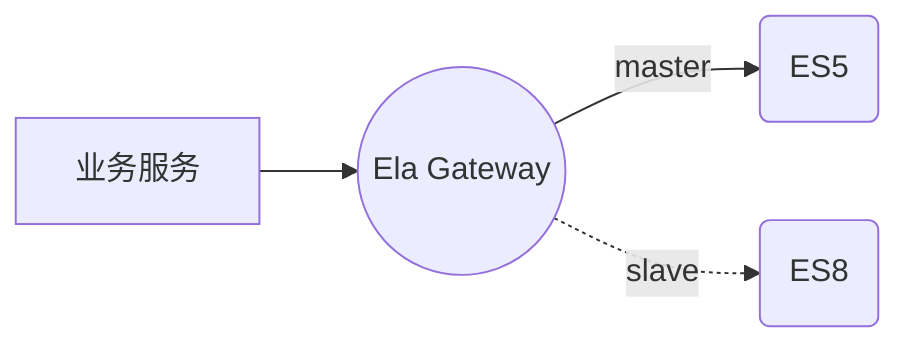
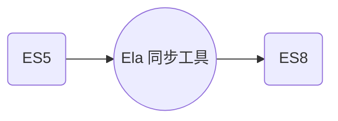
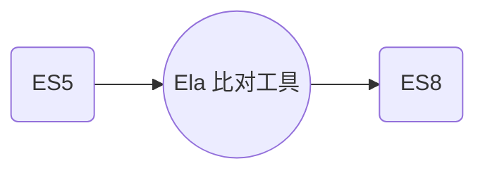
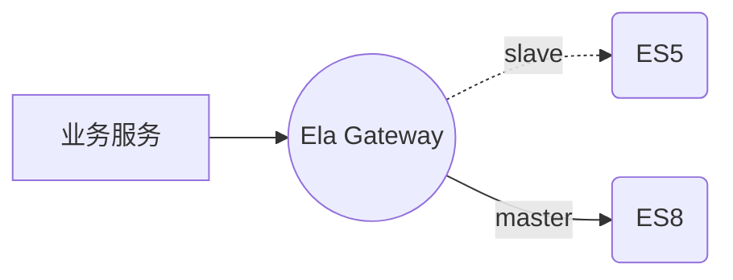
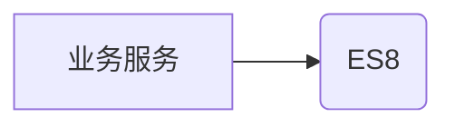

# Elasticsearch 数据迁移总体方案

目前 Elasticsearch 各个大版本之间，不管是接口还是数据存储方面就有一些差异性；如果 Elasticsearch 做大版本升级，需要做数据迁移以及对业务程序进行改造。当前市面上还没有一款开源的功能完成的 ES 数据迁移工具，Ela 是一款可以让业务不用停服进行无损数据迁移的开源方案。迁移工具的地址：https://github.com/CharellKing/ela。

## 名词解释

在本文中涉及到几个名词，需要解释一下，方便读者理解本文。

1. 存量数据：已经存在于 ES 中的历史数据。
2. 增量数据：即将产生并存在于 ES 中的新数据。
3. 源 ES：是指被迁移数据的 ES。
4. 目标 ES：是指数据被迁往的目地 ES。
5. 主 ES：在增量同步的过程中，请求首先被转发的 ES，该 ES 的请求状态被返回给业务服务，被业务感知。
6. 从 ES：在增量同步的过程中，只有读请求被转化给该 ES，并且还是后于 主 ES 转发；并且还是异步的形式，其请求状态不会被业务感知。

## 数据迁移方案

整个数据迁移的步骤如下，以 源 ES5 的数据迁移到 目标 ES8 为例子：

1. 开启增量数据同步，ES5 作为主，ES8 作为 从。
2. 完成存量数据迁移，ES5 全量存量数据迁移到 ES8。
3. 比对两个 ES 的数据差异性，并对差异性数据进行修复；这个过程是一个反复的过程。
4. 待两个 ES 不存在数据差异性，将 ES8 切换为主，ES5 切换为从。
5. 比对两个 ES 的数据差异性，并对差异性数据进行修复；这个过程是一个反复的过程。
6. 待两个 ES 不存在数据差异性，可以将业务服务的切换到直连目标ES，也就是 ES8。整个迁移过程就完成了。

### 开启增量数据同步

涉及到增量数据迁移，就需要使用 Ela Gateway 了，Ela Gateway 对 ES 的请求做了一层转发；并且将 ES 的不同版本的请求参数以及返回参数做了兼容。**对于写请求，Ela Gateway 将请求同步转发给 Master ES，之后将请求异步转发给 Slave ES。** **对于读请求，Ela Gateway 将请求同步转发给 Master ES；对读请求，由于不产生新数据，没有必要请求两次。**** 在开启增量数据同步的时候，需要将源 ES5 设置为主， 目标 ES8 设置为从；因为当前 ES8 里面还没有存量数据，对于读请求，直接读 ES5 对业务不会造成影响。
业务接入 Ela Gateway，只需要将以前直连 ES 的请求切换为连接 Ela Gateway 就可以；不需要做任何其他的修改，基本上对业务代码没有侵入性。
如果需要了解增量数据同步的细节，可以参考[增量数据同步](02-%E5%A2%9E%E9%87%8F%E6%95%B0%E6%8D%AE%E5%90%8C%E6%AD%A5.md)。

## 完成存量数据迁移

在 Ela 方案中，提供了工具，来批量对 ES 中的数据做迁移，其支持正则匹配索引并对指定的索引进行数据同步。同时它也支持多任务，任务与任务支持是顺序执行；在同一个任务内中的不同索引间的数据同步可以并发进行。

如果需要了解存量数据同步的细节，可以参考[存量数据迁移](03-%E5%AD%98%E9%87%8F%E6%95%B0%E6%8D%AE%E8%BF%81%E7%A7%BB.md) 。

## 数据比对

理想状态在比对的过程中 ES5 和 ES8 之间相关索引没有数据差异性；如果出现大量的数据差异性，可以从两个方面排查：1. 增量同步是否出现大量的错误；2.存量迁移是否出现过异常。对于此种问题，应该首先解决增量同步或者存量迁移的问题；其次对有问题的索引数据进行迁移，对于数据差异性不大的索引，可以对指定的 ID 文档进行数据同步；对于差异性很大的索引，则可以对特定索引进行全量的数据迁移。

如果出现少量的数据差异性，可能是因为增量同步的时候，主 ES 已经写入，从 ES 还没有及时写入，导致数据差异性；这时候可以过一会儿，查看从 ES 中是否出现了对应的数据；出现这样的问题，属于正常情况。

如果需要严谨一些，应该设置多个数据比对时间点；比如在全量数据同步完成之后的1天，2天，3天分别进行三次数据比对，如果三次都是正常，那可以基本确定，目前整个数据迁移是没有异常的。

如果需要了解数据比对的细节，可以参考[数据比对](04-%E6%95%B0%E6%8D%AE%E6%AF%94%E5%AF%B9.md)。 

## 主从切换

待两个 ES 之间的数据不存在差异性，才进行主从切换，将主切换到目标 ES8，从切换到 ES5。一定是两个 ES 之间不存在数据差异性，否则时机不成熟，不要去切换。

尽管 ES5 和 ES8 之间的 API 接口存在差异性，但是 Ela Gateway 会将业务方的 ES5 接口转化为 ES8接口去请求 ES8。所以业务服务不需要做修改，切换工作只需要在 Ela Gatway进行就可以，只需要改一行配置。虽然 Ela Gateway 做了兼容；本次切换之后，主要观察业务服务是否会出现异常。

如果需要了解主从切换，可以参考[增量数据同步](02-%E5%A2%9E%E9%87%8F%E6%95%B0%E6%8D%AE%E5%90%8C%E6%AD%A5.md)。

## 数据比对

为了保险起见，最好做一次数据比对，检查源ES 和 目标 ES 中的数据是否有差异。比对方法以及问题排查方式与第三步一致。了解数据比对的详细步骤，可以参考[数据比对](04-%E6%95%B0%E6%8D%AE%E6%AF%94%E5%AF%B9.md)。

## 剥离 Ela Gateway

到这一步整个数据迁移的工作已经完成，这一步是将 Ela Gateway 剥离出去；由于 ES5 和 ES8 的 请求参数以及返回参数存在差异性，没有了 Ela Gateway 去做兼容，就需要去修改业务服务支持目标 ES 的 API 了。

## 总结

整个过程比较繁琐以及耗时很长，建议先在测试环境进行演练；待整个流程走通之后，再在生产环境进行实施。
