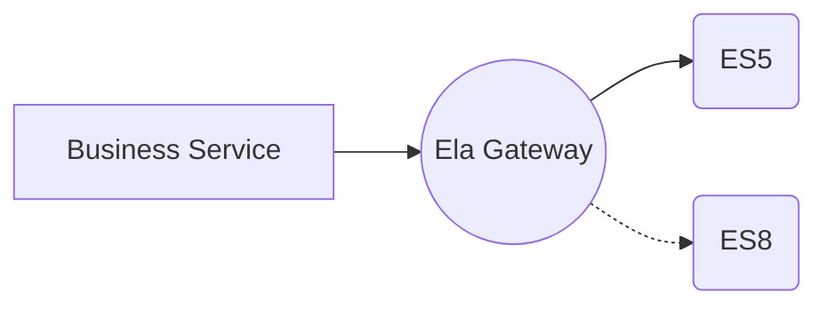
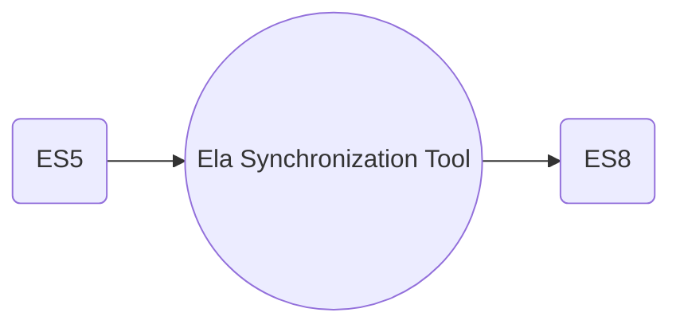
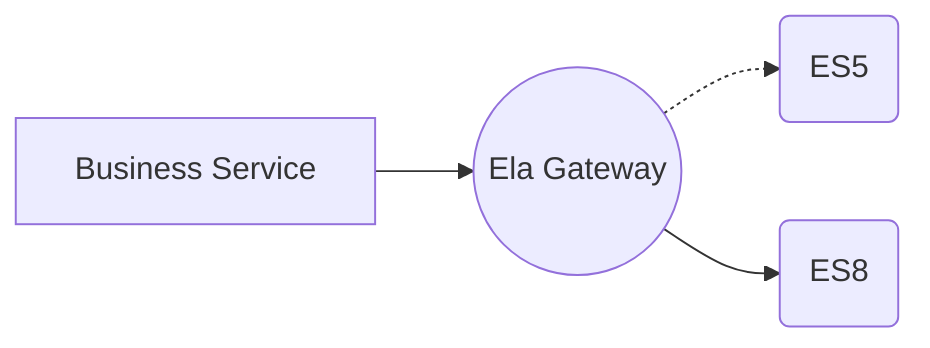
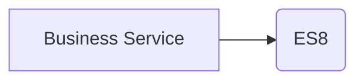

# Elasticsearch Data Migration Overall Solution

Currently, there are some differences between various major versions of Elasticsearch in terms of interfaces and data storage. If Elasticsearch undergoes a major version upgrade, data migration and business program modifications are required. There is currently no open-source tool on the market that fully supports ES data migration. Ela is an open-source solution that allows for lossless data migration without stopping the business. Migration tool address: https://github.com/CharellKing/ela.

## Terminology
Several terms are involved in this article, which need to be explained for the reader's understanding.

**Stock Data**: Historical data that already exists in ES.

**Incremental Data**: New data that is about to be generated and exists in ES.

**Source ES**: Refers to the ES where the data is migrated.

**Target ES**: Refers to the destination ES where the data is migrated.

**Master ES**: In the process of incremental synchronization, the request is first forwarded to ES, and the request status of ES is returned to the business service and is perceived by the business.

**Slave ES**: In the process of incremental synchronization, only read requests are converted to ES, and they are forwarded after the Master ES; and they are asynchronous, and their request status will not be perceived by the business.

## Data migration plan

The steps of the whole data migration are as follows. Take the data migration from source ES5 to target ES8 as an example:

1. Start incremental data synchronization, with ES5 as the master and ES8 as the slave.
2. Complete the migration of stock data, and migrate the full stock data from ES5 to ES8.
3. Compare the data differences between the two ESs and repair the differential data; this process is a repetitive process.
4. When there is no data difference between the two ESs, switch ES8 to the master and ES5 to the slave.
5. Compare the data differences between the two ESs and repair the differential data; this process is a repetitive process.
6. When there is no data difference between the two ESs, you can switch the business service to connect directly to the target ES, which is ES8. The entire migration process is completed.

### Start incremental data synchronization



When it comes to incremental data migration, you need to use Ela Gateway. Ela Gateway forwards ES requests and makes the request parameters and return parameters of different versions of ES compatible. **For write requests, Ela Gateway synchronously forwards the request to the Master ES, and then asynchronously forwards the request to the Slave ES.** **For read requests, Ela Gateway synchronously forwards the request to the Master ES; for read requests, since no new data is generated, there is no need to request twice.** When starting incremental data synchronization, you need to set ES5 as the master and ES8 as the slave; because there is no stock data in ES8, reading ES5 directly will not affect the business.

To access Ela Gateway, you only need to switch the requests that were directly connected to ES to connect to Ela Gateway; no other modifications are required, and there is basically no invasion of business code.

If you need to understand the details of incremental data synchronization, you can refer to [Incremental Data Synchronization](02-Incremental%20Data%20Synchronization.md).

## Complete stock data migration



In the Ela solution, a tool is provided to batch migrate data in ES. It supports regular expression matching of indexes and data synchronization for specified indexes. It also supports multiple tasks, with tasks executed sequentially; data synchronization between different indexes within the same task can be performed concurrently.

If you need to understand the details of stock data synchronization, you can refer to Stock Data Migration.

### Data Comparison
```mermaid
    A(ES5) --> B((Ela Comparison Tool)) --> C(ES8)
```

Ideally, there should be no data differences between ES5 and ES8 during the comparison process. If there are significant data differences, you can check from two aspects: 1. Whether there are many errors in incremental synchronization; 2. Whether there were any exceptions during stock migration. For such issues, you should first resolve the problems in incremental synchronization or stock migration; then migrate the data of problematic indexes. For indexes with small data differences, you can synchronize data for specified ID documents; for indexes with significant differences, you can perform a full data migration for specific indexes.

If there are minor data differences, it may be because during incremental synchronization, the Master ES has already written the data, but the Slave ES has not written it in time, resulting in data differences. In this case, you can wait for a while to see if the corresponding data appears in the Slave ES; this is normal.

To be more rigorous, you should set multiple data comparison time points; for example, perform data comparisons on the 1st, 2nd, and 3rd days after the full data synchronization is completed. If all three comparisons are normal, you can basically confirm that the entire data migration is normal.

If you need to understand the details of data comparison, you can refer to [Stock Data Migration](03-Stock%20Data%20Migration.md).

### Master-slave switching

When there is no data difference between the two ESs, perform master-slave switching, switching the master to Target ES8 and the slave to ES5. Ensure there is no data difference between the two ESs before switching; otherwise, the timing is not mature, and you should not switch.

Although there are differences in API interfaces between ES5 and ES8, Ela Gateway will convert the ES5 interface of the business side to the ES8 interface to request ES8. Therefore, no modifications are needed for the business service, and the switching work only needs to be done in Ela Gateway by changing one line of configuration. Although Ela Gateway provides compatibility, after this switch, you should mainly observe whether there are any abnormalities in the business service.

If you need to understand master-slave switching, you can refer to [Incremental Data Synchronization](02-Incremental%20Data%20Synchronization.md).


### Data Comparison
To be safe, it is best to perform a data comparison to check if there are any data differences between the Source ES and the Target ES. The comparison method and issue troubleshooting are the same as in the third step. For detailed steps on data comparison, you can refer to [Data Comparison](04-Data%20Comparison.md).

### Removing Ela Gateway



At this point, the entire data migration work is completed. This step is to remove Ela Gateway; since there are differences in request parameters and return parameters between ES5 and ES8, without Ela Gateway for compatibility, you need to modify the business service to support the API of the target ES.

## Summary

The entire process is relatively cumbersome and time-consuming. It is recommended to first practice in a test environment; after the entire process is smooth, then implement it in the production environment.


